# The Tic Tac Toe with AI

Play tic-tac-toe with artificial intelligence? This could be fun!

[view the live project here.](https://tic-tac-toe-with-ai-pygame-2d980f4c2d09.herokuapp.com/)

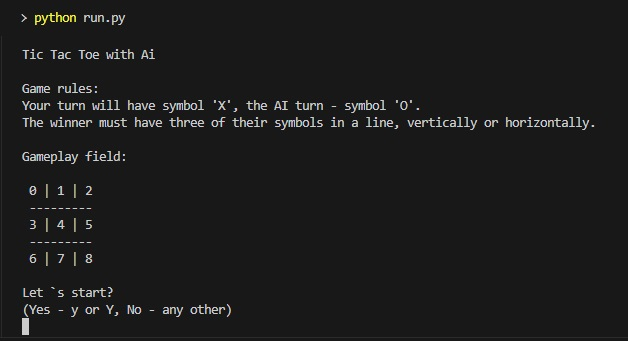

## Introduction

This console game allows you to play a classic Tic Tac Toe game with artificial intelligence.

The AI learns with each game and sometimes makes surprisingly good moves already and even, wins :)

## Table of Contents

- [Project Goals](#project-goals)
- [User Experience](#user-experience)
- [Design](#design)
- [Features](#features)
- [Technologies Used](#technologies-used)
- [Testing](#testing)
- [Bugs](#bugs)
- [Deployment](#deployment)
- [Clone a Repository Code Locally](#clone-a-repository-code-locally)
- [Forking in GitHub](#forking-in-github)
- [Credits](#credits)

---

## Project Goals

### User Goals

- Provide an engaging, old-school game of Tic Tac Toe that users can play against a self-learning AI.
- Offer a leaderboard system where users can see their rankings based on game outcomes.

### Site Owner Goals

- Create an interactive and funny game that keeps users returning and competing for the top leaderboard positions.
- Collect and use gameplay data to improve AI algorithms.
- Improve the owner's machine learning skills.

[Back to Table of Contents](#table-of-contents)

---

## User Experience

### Target Audience

- Individuals looking for a quick and entertaining game that challenges their strategic thinking.
- Players interested in competing against AI with learning capabilities.

### User Stories

- As a user, I want to easily understand how to play the game and what the rules are.
- As a player, I wish to see my game history and how I rank compared to other players.
- As a competitive user, I want the AI to be challenging enough that it provides a sense of accomplishment when I win.

[Back to Table of Contents](#table-of-contents)

---

## Flowchart 

- The flowchart details the logic of the game, the decision-making process of the AI, and the interactions between different modules of the application.

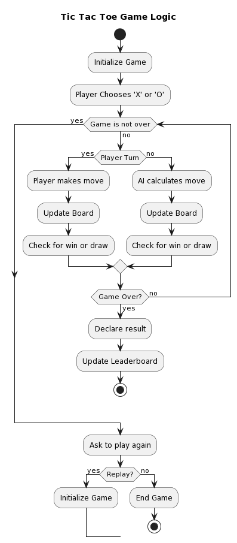

[Back to Table of Contents](#table-of-contents)

---

## Features

### Turns

- **First Move**: By default, the player has the right to make the first move in the initial game. 
- **Alternating First Move**: In subsequent games, the right to the first move alternates. The AI will make the first move in the second game, the player in the third, and so on, ensuring a fair and balanced game experience.

### Welcome Screen

- A friendly interface greets the user and presents them with options to start a new game, view the leaderboard, or exit.

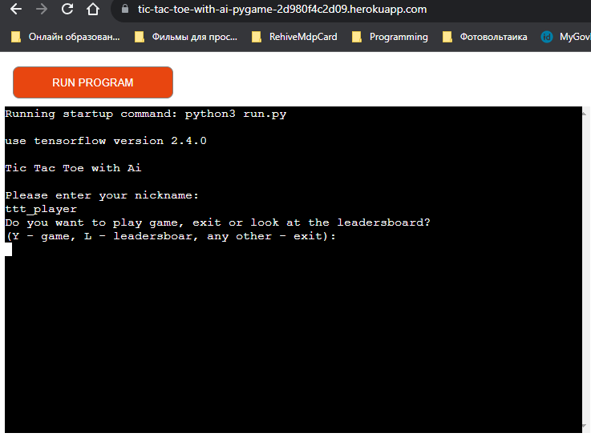

### Game Rules

- The rules are succinctly outlined for quick reference for new and returning players.

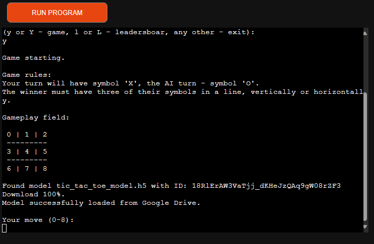

### Game Play

- The game play is turn-based, with the user making moves against the AI. The state of the game is displayed after each move, and the game announces the winner or a draw when the game concludes.
- To assist players in making their moves, a help positions table is displayed alongside the game board. This table shows the number associated with each board position, making it easier for players to indicate their move by entering the corresponding number.

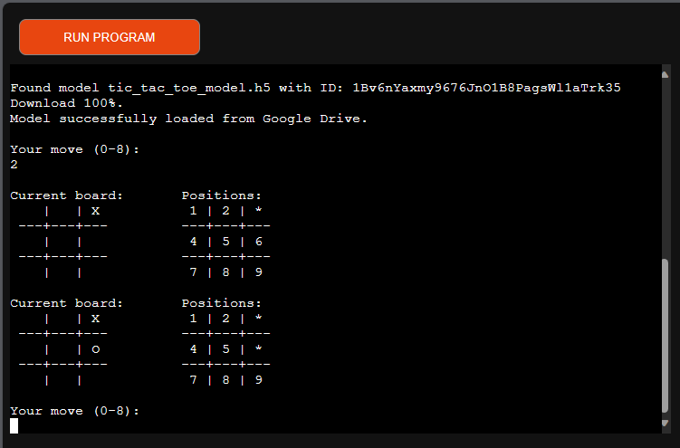

### Game Logic

- The core gameplay is driven by Python scripts that manage the game state, enforce rules, and determine win conditions.
- AI moves are calculated using a pre-trained TensorFlow model, ensuring that each move is optimized based on historical gameplay data.

### Data Integration

- Game data is integrated with Google Sheets, providing a seamless experience for data tracking and leaderboard updates.
- Google Drive API is utilized for model storage and retrieval, allowing the AI to dynamically update based on new gameplay data.

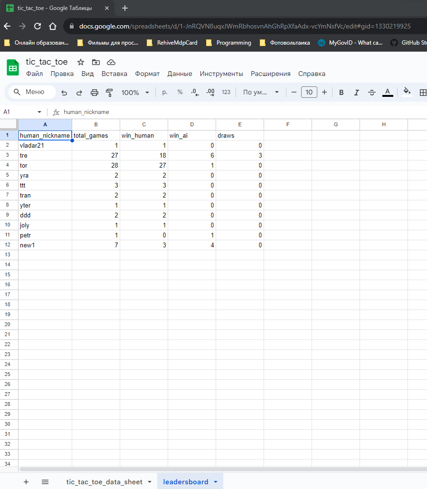

### User Interface

- Custom-designed user interface functions (`tic_tac_toe_ui.py`) facilitate player interaction and display the game state in a clear and intuitive manner.
- The Game board and Leaderboard are displayed in the console, making the game easily playable from any terminal.
- The Positions table showing the number for each position on the board is displayed next to the Game board, helping players easily indicate their moves by entering the corresponding number.
- Current player's position and score are highlighted in yellow color in the Leaderboard to easily track their standing among other players.

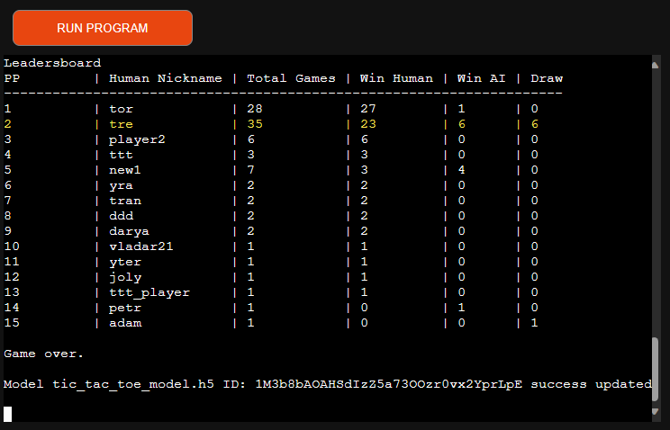

### Code Structure and Management

- Modular coding approach, separating concerns into distinct files (`run.py`, `tic_tac_toe_ui.py`, `tic_tac_toe_google.py`, `tic_tac_toe_tf.py`) for ease of maintenance and scalability.
- Scripts for handling UI presentation, Google operations, and TensorFlow model management are included to keep the main game script (`run.py`) clean and focused on game flow.

```bash
tic-tac-toe/
│
├── tic_tac_toe/                    # Main game code package
│   ├── __init__.py                 # Initializes the tic_tac_toe package
│   ├── tic_tac_toe_google.py       # Module for interacting with Google Sheets
│   ├── tic_tac_toe_ui.py           # User interface module
│   └── tic_tac_toe_tf.py           # Module for TensorFlow operations
│
├── resources/                      # Resources such as images and additional files
│   ├── images/                     # Directory for storing image files
│
├── README.md                       # README file for project description
├── requirements.txt                # File listing the dependencies to install
└── run.py                          # Entry point for the application (if required)
```


### Exception Handling

- Comprehensive error and exception handling to ensure the game remains stable and responsive in all scenarios.
- Specific attention is given to network-related operations where external service disruptions may occur.

### Compatibility and Standards

- Code is written to be Pythonic and follows PEP 8 standards, ensuring readability and maintainability.
- Cross-platform compatibility is considered, with the game being testable on various operating systems.

[Back to Table of Contents](#table-of-contents)

---

## Technologies Used

- Python for the main game logic.
- TensorFlow for implementing and training the AI model.
- Google Sheets API for storing game outcomes and leaderboard.
- Google Drive API for managing the AI model's storage.

[Back to Table of Contents](#table-of-contents)

---

## Testing

### Python Validation

- The code has been validated and conforms to PEP8 standards, with additional static code analysis performed using `flake8`, confirming the absence of style and syntax issues.

 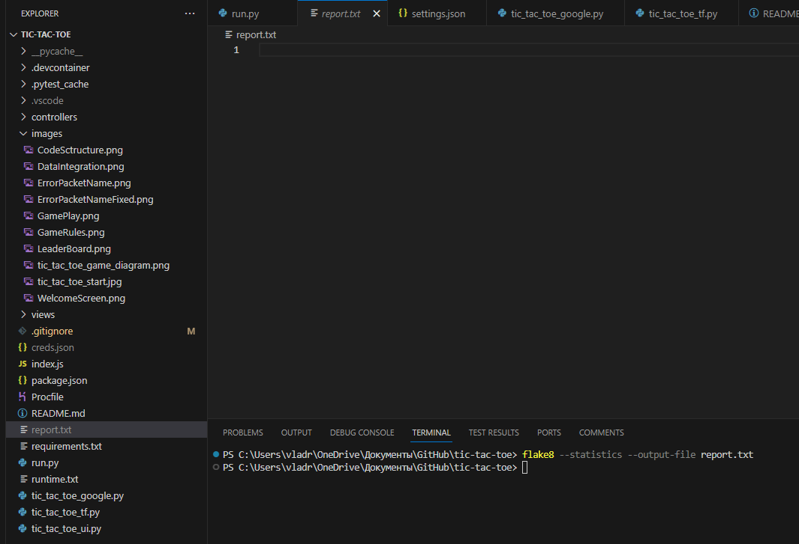

### Manual Testing

- The game was manually tested to ensure all features function as intended and that the user interface is intuitive and responsive.

[Back to Table of Contents](#table-of-contents)

---

## Bugs

### 1. Import could not be resolved

- **Description:** Incorrect import library name.

  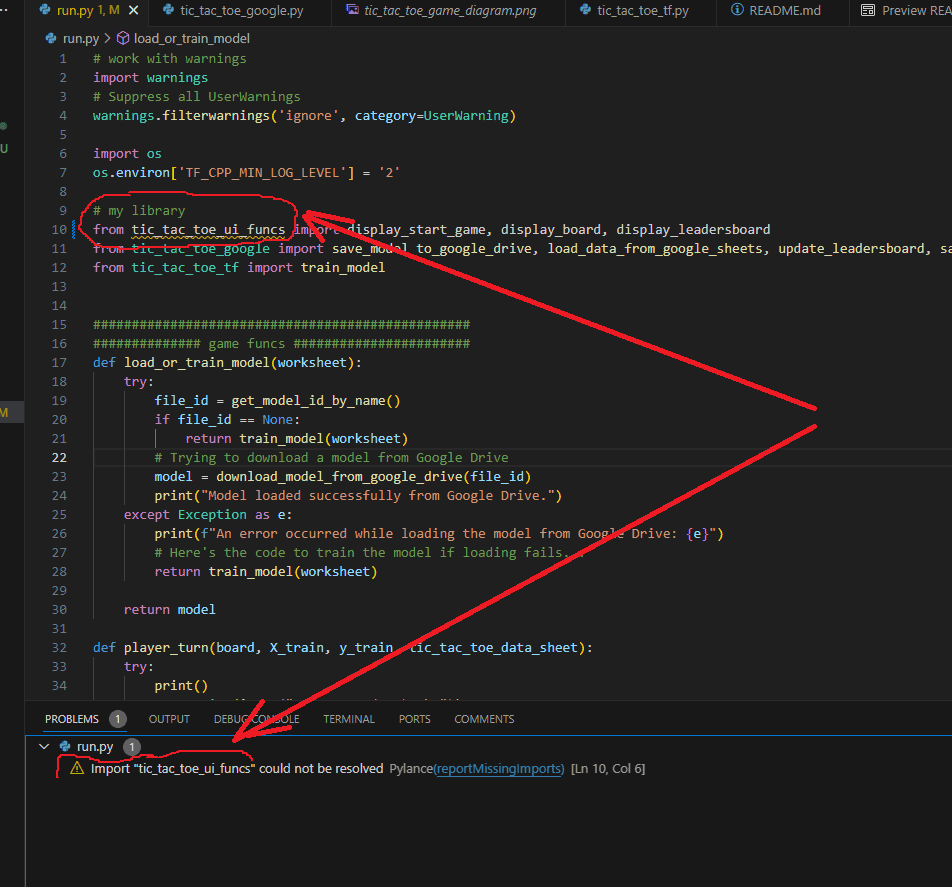

- **Solution:** Fixed import library name.

  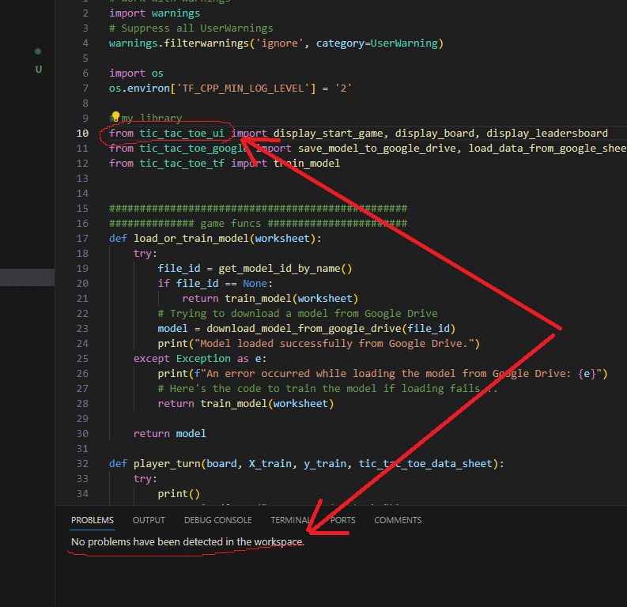

  ### 2. Incorrect start number in help positions table

- **Description:** It must be starting from 0.

  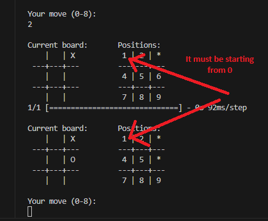

- **Solution:** Fixed one line in display_board func (tic_tac_toe_ui module)

  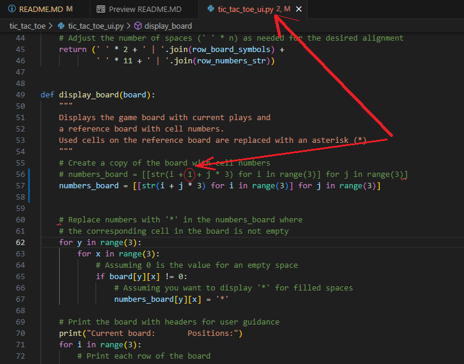

[Back to Table of Contents](#table-of-contents)

---

## Deployment

### Version Control

- The development process utilized Git for version control, with regular commits and descriptive messages to track changes and facilitate collaboration.

### Heroku Deployment

Heroku is a cloud platform that allows developers to build, run, and operate applications entirely in the cloud. Follow the instructions below to deploy your Tic Tac Toe game with AI on Heroku:

#### Prerequisites

- A Heroku account – Sign up [here](https://signup.heroku.com/) if you don't have one.
- The Heroku CLI – Download and install it from [here](https://devcenter.heroku.com/articles/heroku-cli#download-and-install).
- Git installed on your machine.

#### Steps for Deployment

1. **Login to Heroku**: After installing the Heroku CLI, open your terminal and log in to your Heroku account:

    ```bash
    heroku login
    ```

    Your web browser will open for you to log in to your Heroku account.

2. **Create a Heroku App**: Create a new app on Heroku:

    ```bash
    heroku create your-app-name
    ```

    Replace `your-app-name` with a unique name for your application. Heroku will provide you with a web URL and a git URL for deployment.

3. **Prepare Your Application**: Make sure your application meets Heroku's requirements. For Python, you'll need a `Procfile` and possibly a `runtime.txt`:

    - `Procfile`: This file tells Heroku how to run your application. It should be in the root directory of your repository and contain the following:

        ```
        web: node index.js
        ```

    - `runtime.txt`: This optional file specifies a particular Python version for Heroku to use:

        ```
        python-3.8.10
        ```

        Specify the Python version that matches your development environment.

4. **Commit to Git**: If you’ve made any changes like adding `Procfile` or `runtime.txt`, commit them to your git repository:

    ```bash
    git add .
    git commit -m "Added Heroku deployment files"
    ```

5. **Deploy to Heroku**: Deploy your code to Heroku:

    ```bash
    git push heroku main
    ```

    Heroku will now receive your code and start building your app using the Heroku Python buildpack.

6. **Ensure at Least One Instance of the App is Running**:

    ```bash
    heroku ps:scale web=1 --app your-app-name
    ```

    This command tells Heroku to run a single instance of your web app.

7. **Open Your Application**: You can now open your app in the browser:

    ```bash
    heroku open --app your-app-name
    ```

    Alternatively, you can visit the URL provided by Heroku in step 2.

---

### Clone a Repository Code Locally

To clone the repository and run this Tic Tac Toe game locally on your machine, you will need to follow these steps:

#### Prerequisites

Before you begin, make sure you have the following installed:
- [Git](https://git-scm.com/downloads)
- Python (version 3.8.10)
- A text editor or an IDE (like Visual Studio Code, PyCharm, etc.)

#### Cloning the Repository

1. **Open Terminal**: Open your terminal, command prompt, or Git bash in the directory where you wish to clone the repository.

2. **Clone the Repository**: Use the following Git command to clone the repository:

    ```bash
    git clone https://github.com/your-username/tic-tac-toe-with-ai.git
    ```

    Replace `your-username` with the actual username where the repository exists.

3. **Navigate to the Repository Directory**: Once the repository has been cloned, navigate to the cloned repository directory:

    ```bash
    cd tic-tac-toe-with-ai
    ```

4. **Create a Virtual Environment** (optional but recommended): Run the following commands to create and activate a virtual environment:

    For Windows:
    ```bash
    python -m venv venv
    .\venv\Scripts\activate
    ```

    For macOS and Linux:
    ```bash
    python3 -m venv venv
    source venv/bin/activate
    ```

5. **Install Dependencies**: Install all the required dependencies by running:

    ```bash
    pip install -r requirements.txt
    ```

    This command reads the `requirements.txt` file and installs all the Python packages needed for the game to run.

6. **Run the Game**: You can now run the game using the following command:

    ```bash
    python run.py
    ```

    Replace `main.py` with the actual entry script if it’s named differently.

#### Contribute to the Development

If you want to contribute to the game's development, it's generally a good practice to:

1. Fork the repository.
2. Clone your forked version of the repository.
3. Create a new branch for your feature or fix.
4. Make your changes and commit them with descriptive commit messages.
5. Push the changes to your fork.
6. Open a pull request to the original repository.

Please ensure you adhere to the contribution guidelines provided by the repository owner.

[Back to Table of Contents](#table-of-contents)

---

## Credits

### Code

- [TensorFlow](https://www.tensorflow.org/): An open-source machine learning library used to develop and train the AI model for the game.
- [Google API Python Client](https://github.com/googleapis/google-api-python-client): Provides tools for the Python language to interact with Google services, used here for Google Sheets and Google Drive integration.
- [gspread](https://gspread.readthedocs.io/en/latest/): A Python API for Google Sheets, used for handling leaderboard and game state data.
- [OAuth2Client](https://oauth2client.readthedocs.io/en/latest/): A library for OAuth version 2.0, used to authorize the app to access Google Sheets and Drive.

### Design

The user interface of the Tic Tac Toe game is the result of thoughtful design considerations aimed at providing a simple, intuitive, and enjoyable experience. Key inspirations and design assets used are acknowledged below:

- __Minimalist Aesthetic__: The clean and uncluttered look of the game draws on the principles of minimalist design to avoid distractions and focus on gameplay.
- __Classic Tic Tac Toe Influence__: The classic Tic Tac Toe board, a simple grid, sets the fundamental visual structure for the game, providing immediate familiarity to users.

### Acknowledgements

-   My Mentor - Oluwafemi Medale - for continuous helpful feedback.

-   Tutor support at Code Institute for their support.

## License

This project is licensed under the MIT License.

[Back to Table of Contents](#table-of-contents)
